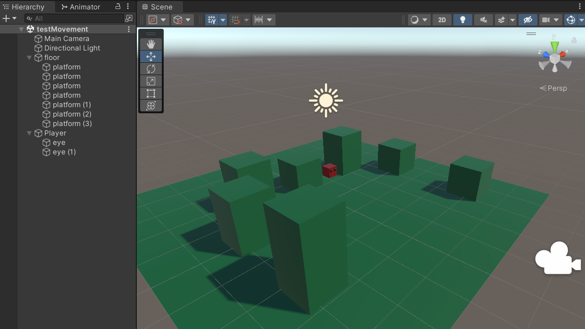
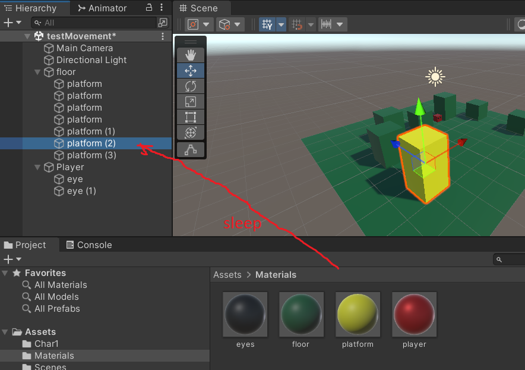
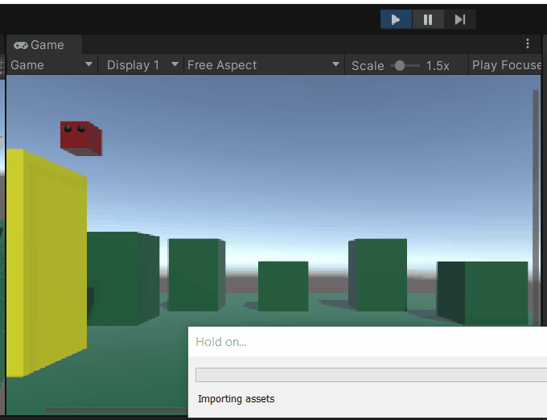
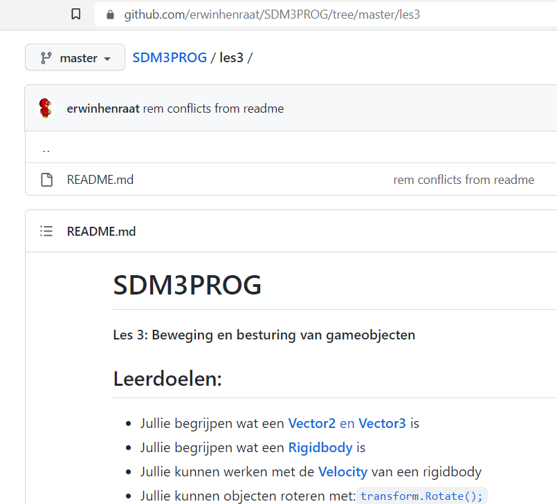
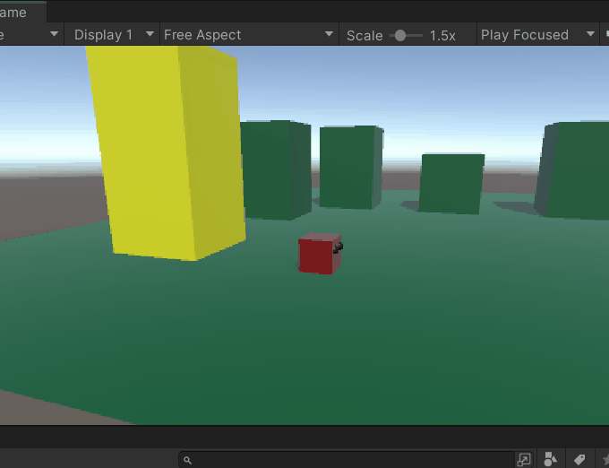
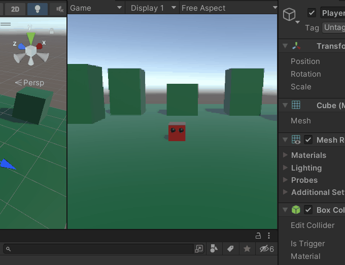
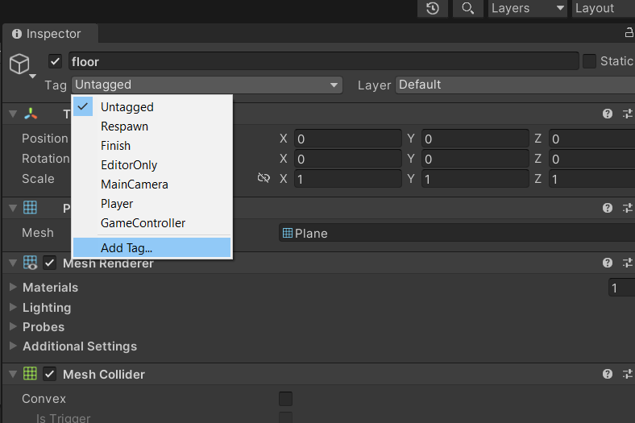
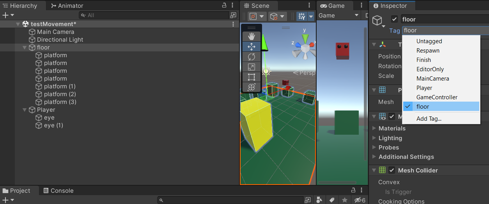

# Tutorial 3

**Springen op platforms (& traps)**

## Leerdoelen:

- Jullie kunnen direct de **velocity** Vector manipuleren voor beweging
- Jullie kunnen functies gebruiken zoals [**AddForce()**](https://docs.unity3d.com/ScriptReference/Rigidbody.AddForce.html) wat de velocity manipuleert
- Jullie kunnen in Unity een simpel platform level opzetten
- Jullie kunnen een speler object laten rondlopen
- Jullie kunnen een speler object laten springen
- Jullie kunnen je rigidbody passend instellen
- Jullie kunnen gameobjecten **parenten**
- Jullie kunnen **tags** maken en gebruiken
- Jullie kunnen **collisons** gebruiken in je script

## Stappenplan:

Voer de onderstaande stappen uit en laat in de volgende les zien hoe ver je bent gekomen.

Als je klaar bent laat je het ook zien.

Als je vast zit vraag je om hulp!

### Jullie gaan deze les aan de gang om en simpele platformer te bouwen:


### 1. Maak een nieuwe scene aan: via file > new scene


Kies de basic (built-in) scene

### 2. Maak een level



Het level bevat

- Een plane (vloer)
- Cubes (platforms)
- Nog een cube met spheres erin (player met oogjes)

Door de spheres in de cube te slepen in de hierarchy worden ze onderdeel van de cube. Dit heet parenting.
Ook mijn platforms zijn onderdeel van mijn floor oftewel mijn level.


### 3. Geef je gameobjecten een kleur met eigen materials

- Maak een folder aan voor je Materials


- Click rechts en selecteer **create > Material**


- Geef je materials een naam


- Geef je materials een kleur


- Sleep de materials op je gameobjecten



### 4. Zorg dat de Player dit niet kan doen !



Maar dat hij Op het platform blijft staan tot hij volledig over de rand gaat.


**_Hint: check je Rigidbody_**

### 5. Laat je Cube (speler) rondlopen

**Zie les 3 ;)**



### 6. Laat je Cube springen

- Maak een nieuw Jump.cs script aan
- Sleep deze op je Cube (player)
- Open het script in je code editor

- Zorg voor een _private_ variabele (bijv. **rb**) waarin je je **Rigidbody** opslaat in de **void Start()** Method

- Zorg dat je in de **void Update()** checkt of de [**spatiebalk** is ingedrukt](https://docs.unity3d.com/ScriptReference/Input.GetKeyDown.html)

- Zorg voor een _public_ variabele **force** die bepaalt hoe hard/hoog je kunt springen geef deze een **default** waarde van **20f**

```
public float force = 20f;
```

- Gebruik de [**AddForce() method**](https://gamedevbeginner.com/how-to-jump-in-unity-with-or-without-physics/#jump_unity) om de speler te laten springen.

### 7. Laat je Cube goed en _bugvrij_ springen

**Mogelijk werkt deze nu heel erg crappy!**



**Schakel dan eens je **Move** script uit!**


**Gefeliciteerd! Je hebt een:**
Dit betekent dat je code werkt en geen fouten heeft of errors geeft alleen niet doet wat je verwacht en wilt!

**Dit is de boosdoener:**

```
    void Update()
    {
        rb.velocity = rb.transform.forward * move;
    }
```

Elke keer wanneer er in je **Jump.cs** script **AddForce()** wordt aangeroepen past deze je velocity aan.
Echter wordt deze velocity door je Move script steeds weer overschreven waardoorde waarde van je velocity op de y as weer **0** wordt
Hierdoor wordt de sprong gecanceled!

**Dit is _een_ oplossing:**

```
    //rb.velocity = rb.transform.forward * move;
    Vector3 lastVel = rb.velocity;
    Vector3 newVel = rb.transform.forward * move;
    newVel.y = lastVel.y;
    rb.velocity = newVel;
```

Begrijp je wat er nu gebeurt??!

**Nog een Bug!**



Of eigenlijk heb je nog niet geprogrammeerd dat je maar 1x mag springen totdat je weer bent geland.

- Maak een variabele aan die bijhoudt of je op de grond staat of niet (_welk datatype is hier handig voor? wel of niet op de grond!_)
- Zet de waarde op **False** aan het begin van je script
- Zet de waarde op **False** op het moment dat je springt en dus de **AddForce()** methode aanroept
- Gebruik de **void OnCollisionEnter()** Methode om te checken of je op de grond staat:

```
private void OnCollisionEnter(Collision collision)
{
    if (collision.gameObject.tag == "floor") {
        onFloor = true;
    }
}
```

- Zorg er voor in je **Jump** script dat je alleen kan springen als **onFloor** de waarde **True** Heeft.

```
    if (Input.GetKeyDown(KeyCode.Space) && onFloor == True)
```

<a name="tag">..</a>

- Maak nu in Unity een nieuwe **Tag** aan: **"floor"**



- Geef nu je vloer en al je platforms deze nieuwe tag



- Test je Game!


### Commit en push je werk naar je eigen branch. Laat je Unity scene, je code en je repository zien aan de docent!
