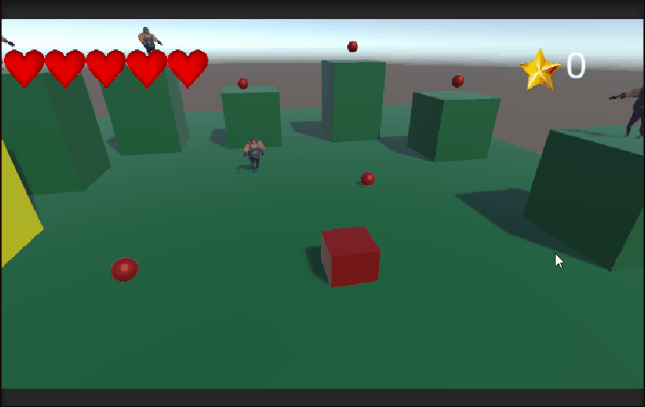
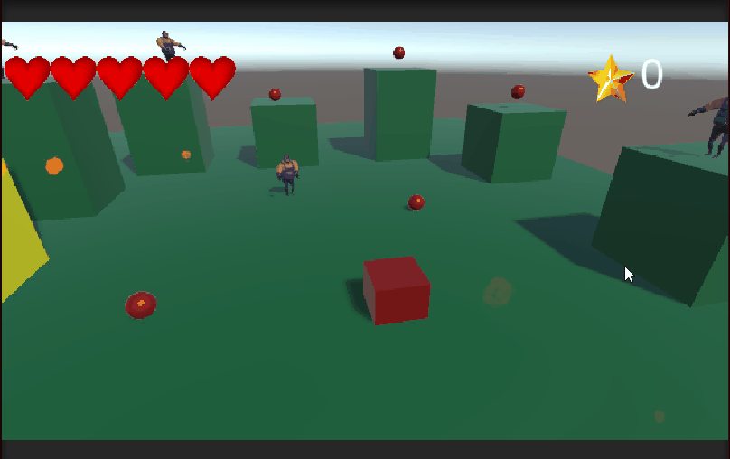
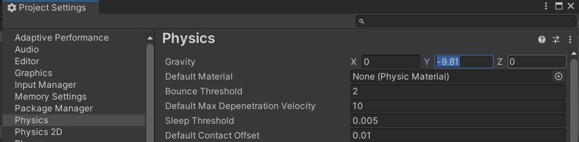
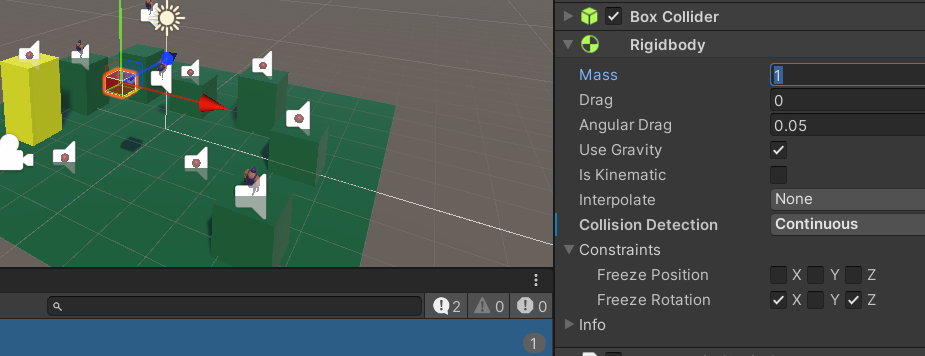
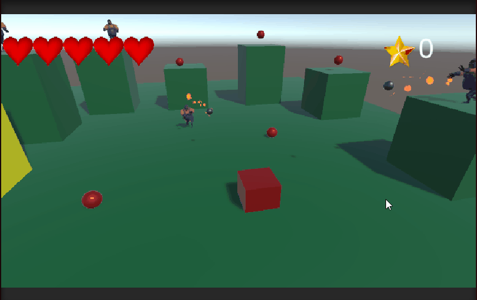
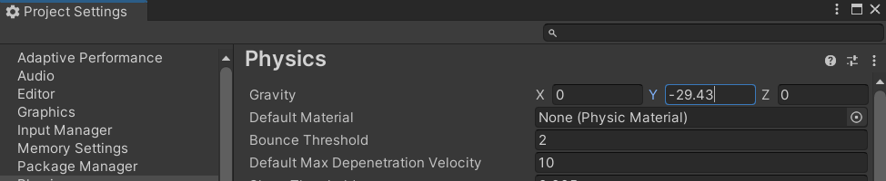
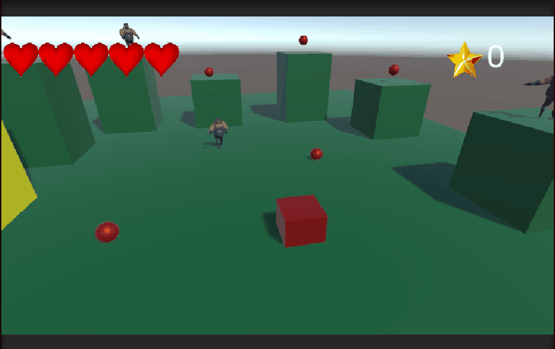
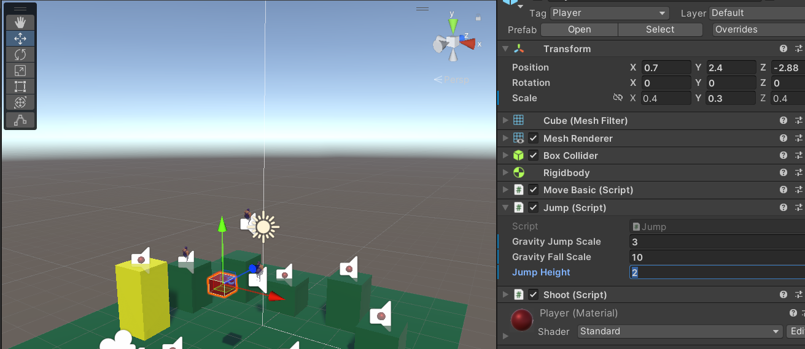
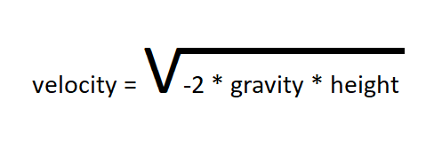
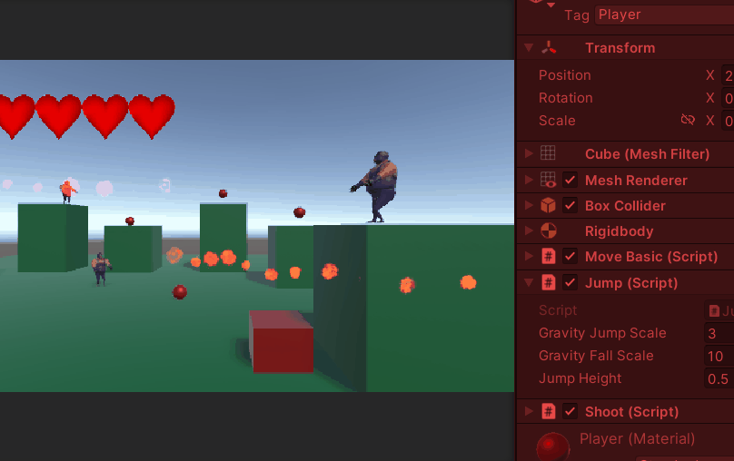

# Tutorial 7

**Verdieping in het springen**

## Leerdoelen:

- De student kan een jump mechanic maken die lekker aanvoelt
- De student kan een jump mechanic met een rigidbody goed tweakbaar maken
- De student kan zonder rigidbody met een wiskundige formule een jump mechanic maken

## Stappenplan:

Voer de onderstaande stappen uit en laat in de volgende les zien hoe ver je bent gekomen.

Als je klaar bent laat je het ook zien.

Als je vast zit vraag je om hulp!

### We fixen de "floaty" jump mechanic :

#### Floaty :(



#### Not Floaty :)



[Hier](https://gamedevbeginner.com/how-to-jump-in-unity-with-or-without-physics/) vind je fantastische uitleg over het maken van jumps in Unity. Als je het fijn vind kun je die uitleg volgen of je volgt deze tutorial.

### 1. Zorgen voor een gravity scale

Om je jump animatie minder floaty te krijgen moet je de Gravity Scale (kracht waarmee je naar beneden wordt getrokken) verhogen.
Unity heeft voor 3d objecten geen standaard gravity scale eigenschap dus die gaan we zelf programmeren.
Onderstaande code kun je in je **FixedUpdate()** zetten

```
    rb.AddForce((gravityScale-1)*Physics.gravity * rb.mass);
```

- De variabele **gravityScale** maak je public zodat je deze in de inspector kunt aanpassen.
- Je haalt er 1 vanaf omdat de gravity van unity je gameobject al naar beneden trekt. Je wil dus geen extra gravity als de scale 1 is.
- **Phisics.gravity** is een Vector3 variabele die instelbaar is vanuit **edit > Project Settings > Physics** standaard is de waarde **(0 , -9.81 , 0)** _De zwaartekracht op aarde_.



- **rb.mass** is de massa van je gameobject. Deze is instelbaar op je Rigidbody.



Omdat er extra kracht is die je player naar beneden trekt zul je de waarde van **jumpforce** moeten verhogen.



Test of je gravity 3x zo groot is als je de scale op 3 zet

Je had in dit geval ook de **Gravity.y** waarde van je project op **-29.43** kunnen zetten. ;)



### 2. Langzaam omhoog en snel naar beneden

Om een goede controleerbare sprong te maken wil je de speler wat langzamer omhoog bewegen en sneller naar beneden.



Hiervoor zorgen we voor 2 variabelen :

- **gravScaleUp**
- **gravScaleDown**

Zorg dat ze instelbaar zijn in je inspector, de variabele **gravityScale** hoeft dat niet meer te zijn dus maak die private!

Nu kijken we in de **Update** of we omhoog of omlaag gaan en passen we de gravity scale hierop aan.

```
        if (rb.velocity.y > 0) {
            gravityScale = gravScaleUp;
        } else if (rb.velocity.y < 0) {
            gravityScale = gravScaleDown;
        }
```

Geef **gravScaleUp** een lagere waarde dan **gravScaleDown** en test hoe dit eruit ziet. Je zou sneller moeten dalen dan stijgen.

### 3. Sprong hoogte instellen i.p.v jumpforce

Om goed te kunnen controleren hoe hoog je wil springen is het niet handig om rechtstreeks de jumpForce in te stellen. Het is beter om gewoon in te kunnen stellen hoe hoog je moet kunnen springen. (in unity units)



De wiskundige formule voor het bepalen van de velocity om tot een bepaalde hoogte te springen is als volgt:



Vertaald naar code is dit:

```
    jumpForce = Mathf.Sqrt(-2 * Physics.gravity.y * jumpHeight);

```

Houd er wel rekening mee dat je de **gravity scale** hebt aangepast dus je zal de aangepaste gravity scale moeten verrekenen.

```
    jumpForce = Mathf.Sqrt(-2 * Physics.gravity.y * gravityScale * jumpHeight);

```

De spring hoogte is niet 100% nauwkeurig maar de afwijking is wel consistent en het komt erg in de buurt.


Test je game!

### Commit en push je werk naar je eigen branch. Laat je Unity scene, je code en je repository zien aan de docent!
