# Tutorial 8:

**Maak een exploding trap**

## Leerdoelen:

- Jullie maken kennis met het particle system
- Jullie kunnen particles via script aansturen
- jullie kunnen werken met Triggers

## Stappenplan:

Voer de onderstaande stappen uit en laat in de volgende les zien hoe ver je bent gekomen.

Als je klaar bent laat je het ook zien.

Als je vast zit vraag je om hulp!

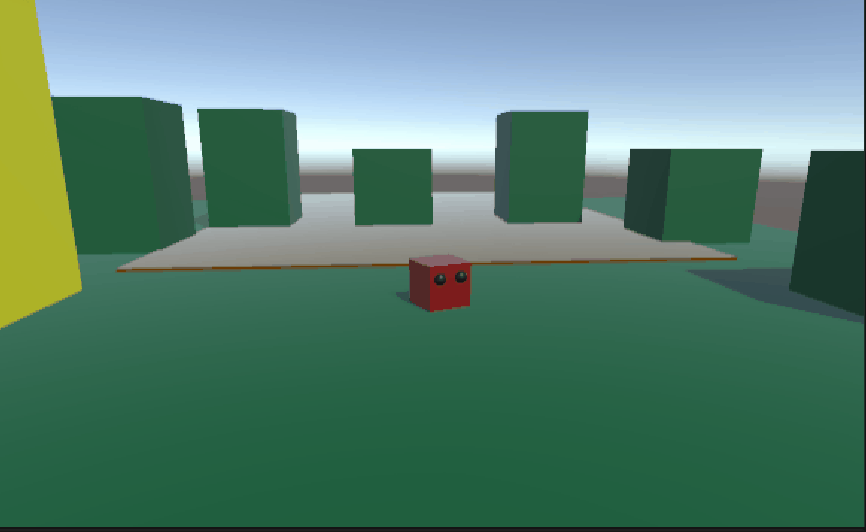

### 1. maak een trap

- Maak een Cube en noem hem **"trap"**
  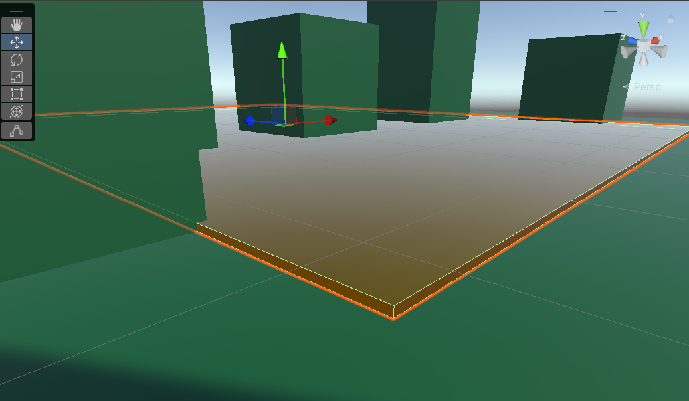

### 2. maak een explosion effect met particles

- Voor een mooi explosie effect kun je [deze video](https://www.youtube.com/watch?v=cvQiQglPI18) bekijken

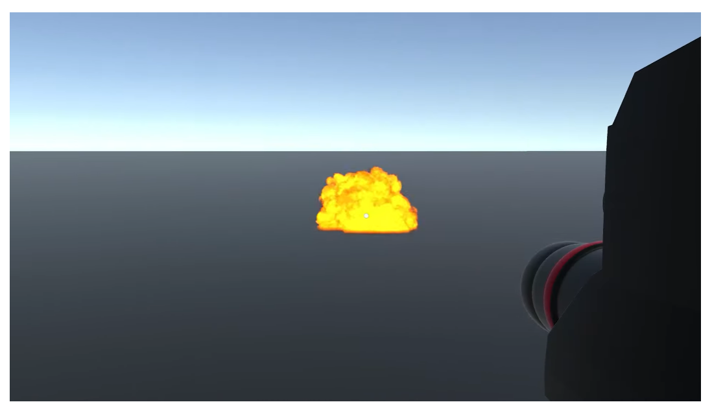

### 3. maak een script voor je explosie

- Hang een nieuw script aan je **Trap** noem het **"TrapTrigger"**

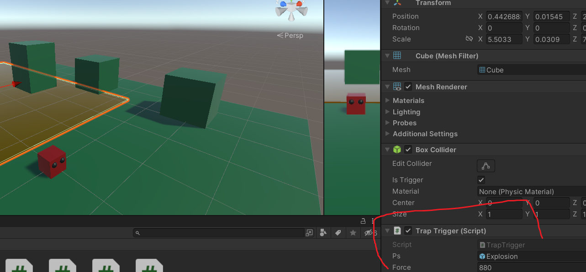

- Maak de noodzakelijke variabelen

```
    public GameObject ps;
    public float force = 200f;
```

**ps** staat voor particle system daarmee kun je de particles inladen en aansturen
**force** is voor de kracht waarmee je speler wordt weggeslingerd

<a name="prefab">...</a>

- Sleep je **explosion** prefab in je **ps** variabele

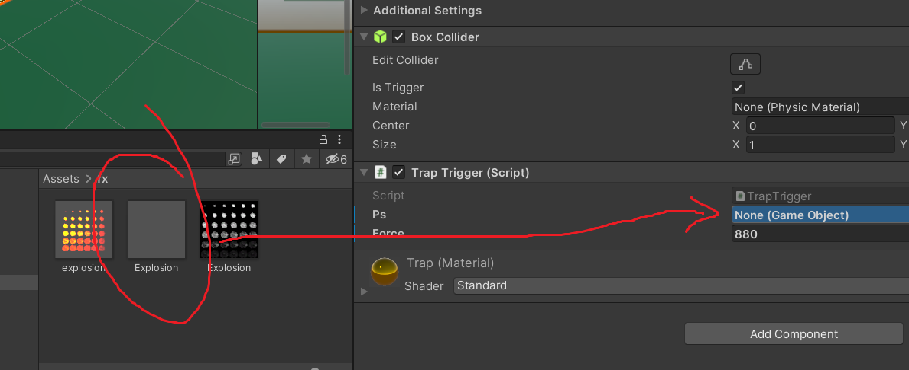

- Zet de tag voor de speler op **"Player"**

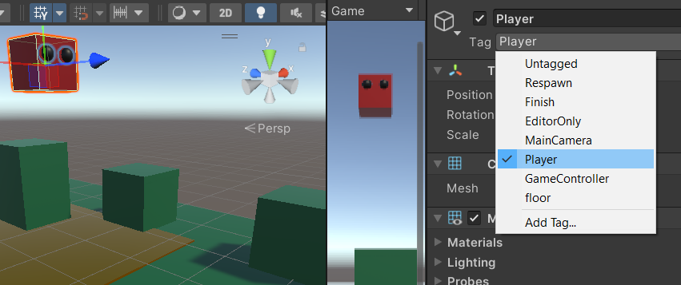

- Maak van de **collider** van je **trap** een **trigger**

Kun je bedenken wat het verschil is tussen een **collider** en een **trigger**?

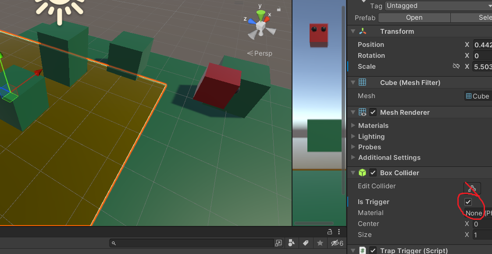

- Voeg de **OnTriggerEnter()** methode toe aan je script

```
private void OnTriggerEnter(Collider other)
{

}
```

Deze wordt automatisch aangeroepen als iets de **"trigger"** van je **trap** raakt

- Check wie de trap heeft geraakt door de tag te controleren

```
    if (other.gameObject.tag == "Player"){

    }
```

- Als de trigger door de player wordt geraakt moet de speler worden gelanceerd! Gebruik hiervoor de methode [**AddExplosionForce()**](https://docs.unity3d.com/ScriptReference/Rigidbody.AddExplosionForce.html)
- Daarnaast moeten de controls worden uitgezet zodat je de speler niet meer kan bewegen. Om een ander script te vinden gebruik je de methode **GetComponentInChildren<>()**

```
    if (other.gameObject.tag == "Player"){
         //Lanceer
         Rigidbody rb = other.GetComponent<Rigidbody>();
         Transform t = other.transform;
         rb.AddExplosionForce(force, new Vector3(t.position.x,t.position.y,t.position.z), 0f);
         //Controls uit
         MoveBasic mbScript = other.GetComponentInChildren<MoveBasic>();
         mbScript.enabled = false;

    }
```

### 4. Experimenteer

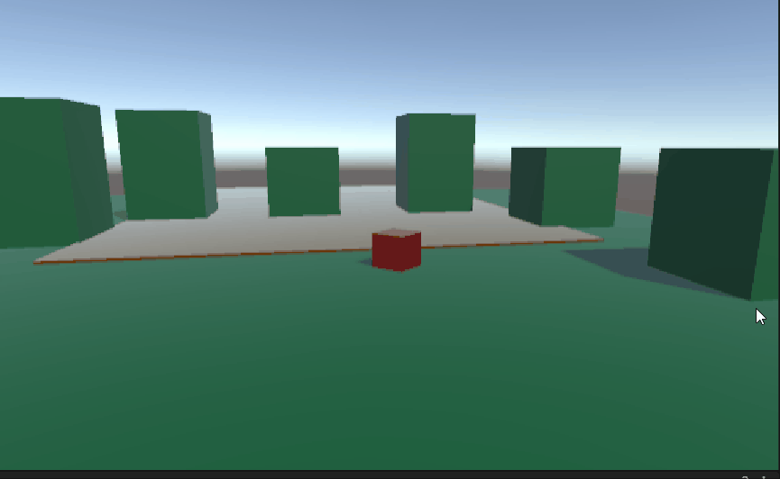

De explosie vindt plaats midden in je **Player** waardoor je de lucht in vliegt.

- Verplaats de positie van de explosie ten opzichte van je **Player** en bekijk het effect

```
    rb.AddExplosionForce(force, new Vector3(t.position.x,t.position.y,t.position.z + 1f), 0f);
```

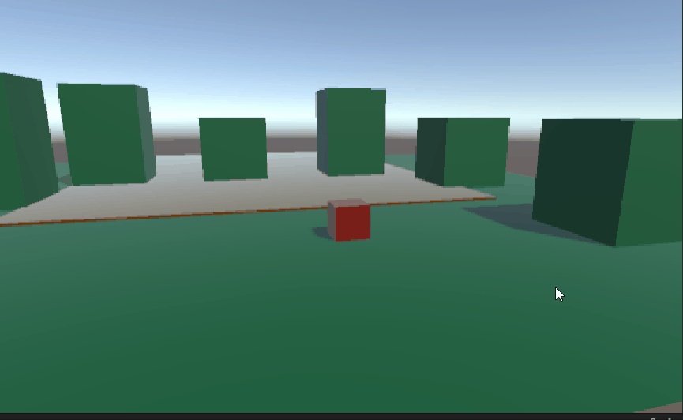

- Zorg dat je Player tijdens de explosie alle kanten op kan draaien

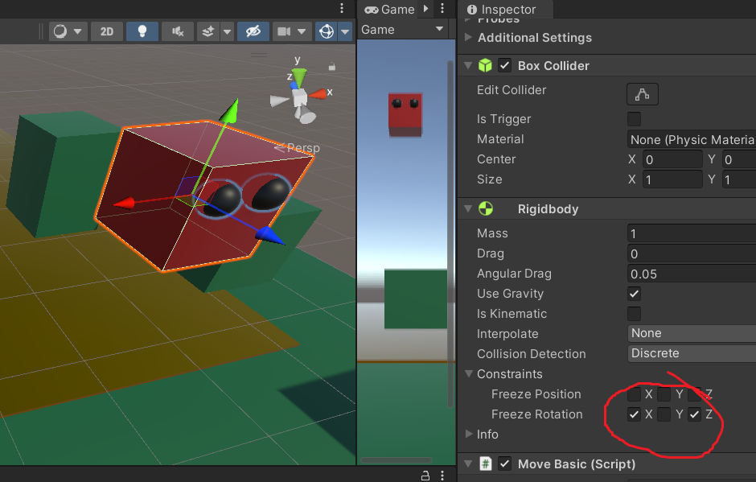

Om dit te doen moeten de constraints van je rigidbody uitgezet worden vlak voor de explosie

```
    rb.constraints = RigidbodyConstraints.None;
```

### 5. Laat de speler achteruit vliegen

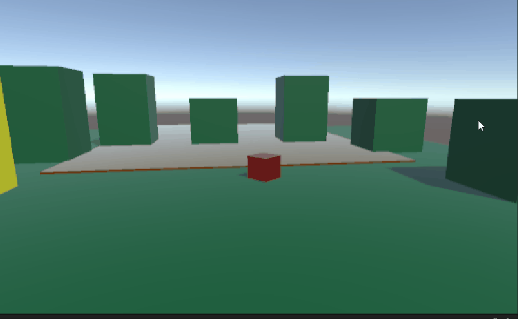

- Zorg dat de player ook omhoog en naar achteren gaat

### 6. Implementeer de particles

- Nu is het tijd om je particle system te implementeren voor een echte explosie

Iets op het scherm zetten wat er nog niet is noemen we **"instantieren"** hiervoor gebruik je de Methode [**Instantiate()**](https://docs.unity3d.com/ScriptReference/Object.Instantiate.html)

- instatieer het **particle system** dat je als prefab aan de variabele **ps** <a href="#prefab">hebt gehangen</a>.

```
    GameObject p = Instantiate(ps, transform);
```

- plaats het **particle system** op de juiste plek (positie van de speler)

```
    p.transform.position = t.position;
```

- verwijder het **particle system** na een seconde

```
    Destroy(p,1);
```

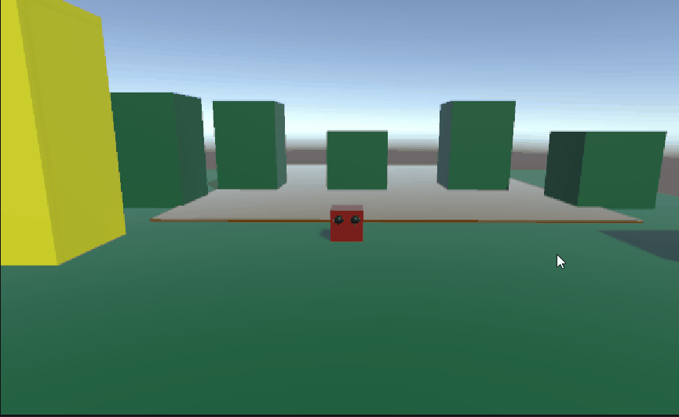

Voila!

### Commit naar je eigen branch en push je werk. Laat je Unity scene, je code en je repository zien aan de docent!
